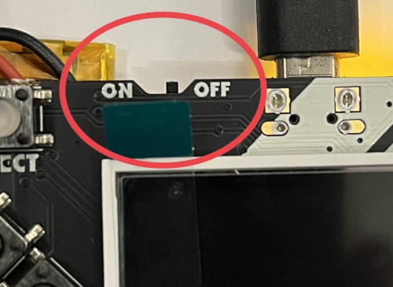

# GoBadge

TinyGo powered badge using the Adafruit Pybadge hardware.

https://www.adafruit.com/product/4200

# How to install

- Install TinyGo using the instructions from https://tinygo.org

- Clone this repo

- Change directories into the directory with the repo

- Connect your Pybadge to your computer using a USB cable

- Make sure to turn on the badge, flip the switch at the top of the board next to `select` to the `on` position. The screen should light up with a sign way display.



- Run this command to compile and flash the code to your Pybadge:

```
make flash
```

or 

```
tinygo flash -target pybadge .
```

Note: if you get a `permision denied` error; please, consult this [page](https://tinygo.org/docs/guides/tinygo-flash-errors/) for possible solution. You many need to restart the computer; afterward to get the group to stick.

- To display a conference logo on your badge, use one of the following targets (depending on GC for Europe, UK, or US):
```
make flash-gceu
make flash-gcuk
make flash-gcus
```

- To customize the Gobadge with your own name and information, use the `NAME`, `TITLE1`, and `TITLE2` variables like this:

```
make flash-gcus NAME="@TinyGolang" TITLE1="Go compiler" TITLE2="small places"
```

# Add an new logo

- Create an image with a 160x128 pixels size, copy it into `cmd/assets` folder.  
For the moment only jpeg images are supported.  
- In `cmd/main.go` add the path to your file here

```go
const (
gopherconEU22Logo = "./cmd/assets/gopherconeu-2022.jpg"
gopherconUK22Logo = "./cmd/assets/gopherconuk-2022.jpg"
gopherconUS22Logo = "./cmd/assets/gopherconus-2022.jpg"
yourPathLogoHere = "./your/path/to/the/logo"
)
```

- Add the corresponding flag to the conf map:

```go
func confs() map[string]string {
	return map[string]string{
		"gceu22"    : gopherconEU22Logo,
		"gcuk22"    : gopherconUK22Logo,
		"gcus22"    : gopherconUS22Logo,
		"flagLogo"  : yourPathLogoHere,
	}
}
```

Add a new target to the Makefile:

```bash
flash-yourconf:
	go run cmd/main.go -conf=flagLogo
	tinygo flash -target pybadge .
```

You can run:

```bash
make flash-yourconf
```

It will use `cmd/logos/logo-template.txt` to generate the image into a `[]color.RGBA`.
Then it is stored in variable in `logo.go` file.

```go
package main

import "image/color"

var logoRGBA = []color.RGBA{ {255, 255, 255} }
```

After the image has been generated, the make command will flash it to the board.


👏 Congratulations! It is now a GoBadge.
