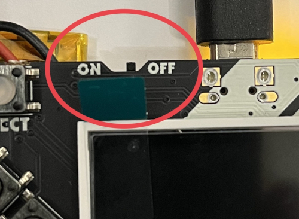

# GoBadge Tutorial

## What you need

    - GoBadge aka Adafruit PyBadge
    - Personal computer with Go 1.18/1.19 and TinyGo installed, and a serial port.

## Installation

### Go

If somehow you have not installed Go on your computer already, you can download it here:

https://go.dev/dl/

Now you are ready to install TinyGo.

### TinyGo

Follow the instructions here for your operating system:

https://tinygo.org/getting-started/

## Connecting the GoBadge to your computer


Plug the GoBadge into your computer using a USB cable. There may be one provided in your starter kit.

Make sure that the GoBadge is on.



## Running the code

The TinyGo programs will run directly on the GoBadge's microcontroller. The procedure is basically:

- Edit your TinyGo program.
- Compile and flash it to your GoBadge.
- The program executes from the GoBadge. You can disconnect the GoBadge from your computer (plug it into a battery, if it isn't already), the program executes directly on the microcontroller.

Let's get started!

## Code

### step0.go - Built-in LED

This tests that you can compile and flash your PyBadge with TinyGo code, by blinking the built-in LED (it's on the back).


```
tinygo flash -target pybadge ./step0
```


Once the PyBadge is flashed correctly, the built-in LED labeled "D13" (on the back) should start to turn on and off once per second. Now everything is setup correctly and you are ready to continue.


### step1.go - Built-in LED, START Button

Run the code.

```
tinygo flash -target pybadge ./step1
```

When you press the START button, the built-in LED should turn on.


*Challenge:* 
See if you can modify [./step1/main.go](step1/main.go) so that the LED turns on if
the _SELECT_ button is pressed instead of the _START_ button.

### step2.go - Neopixels

Run the code.

```
tinygo flash -target pybadge ./step2
```


The 5 neopixels should light up green and red alternatively.


### step3.go - Neopixels, Buttons

Run the code.

```
tinygo flash -target pybadge ./step3
```

The 5 neopixels should light up in different colors depending on which button you press.

What happens if you press more than one button at a time?

try out `./step3b`, what does it do?

After deploying it should look like this:


### step4.go - Light sensor, Neopixels

Run the code.

```
tinygo flash -target pybadge ./step4
```


### step5.go - Display

Run the code.


```
tinygo flash -target pybadge ./step5/main.go
```

The message "Hello Gophers!" should appear on the display.

### step6.go - Display, Buttons


Run the code.

```
tinygo flash -target pybadge ./step6/main.go
```

The display will show some blue circles. When a button is pressed a ring will be shown around its corresponding circle.

### step7.go - Display, Accelerometer


Run the code.

```
tinygo flash -target pybadge ./step7/main.go
```

The display will show a bar for each X,Y,Z axis. Move the Pybadge to see it in action.

### step8.go - Buzzer, Buttons

Run the code.

```
tinygo flash -target pybadge ./step8/main.go
```

Press the buttons and create your melody.

### Snake Game


Run the code.

```
tinygo flash -target pybadge ./snake
```

Play the famous Snake game on the pybadge.

### My Name Is


Run the code.

```
tinygo flash -target pybadge ./mynameis
```

Configure your name and use the awesome TinyGo-powered badge!
