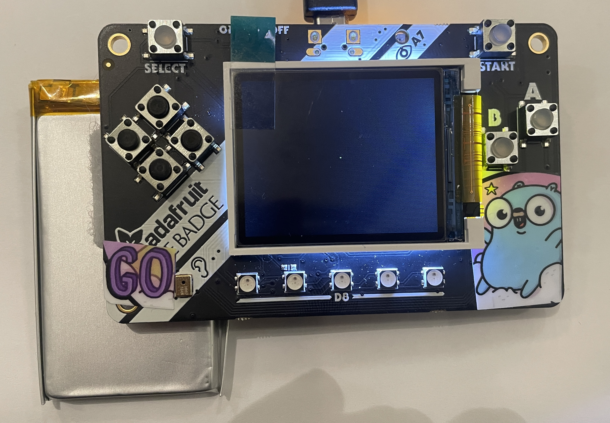
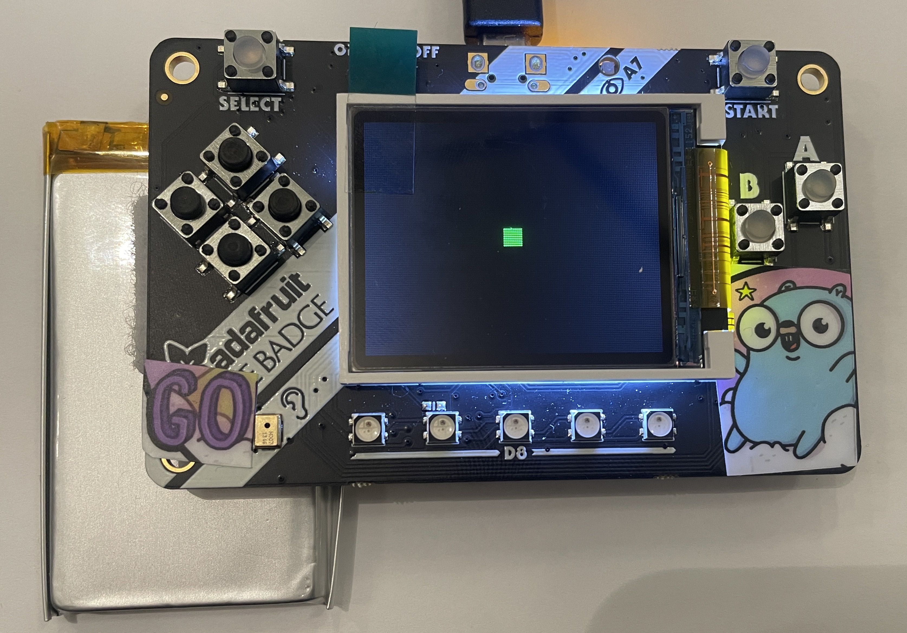
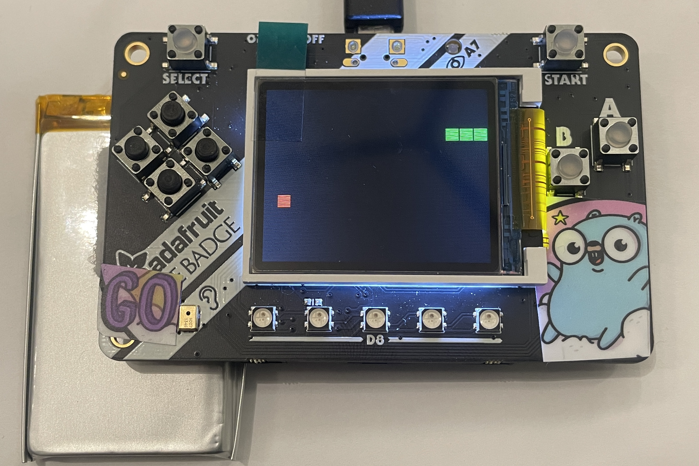
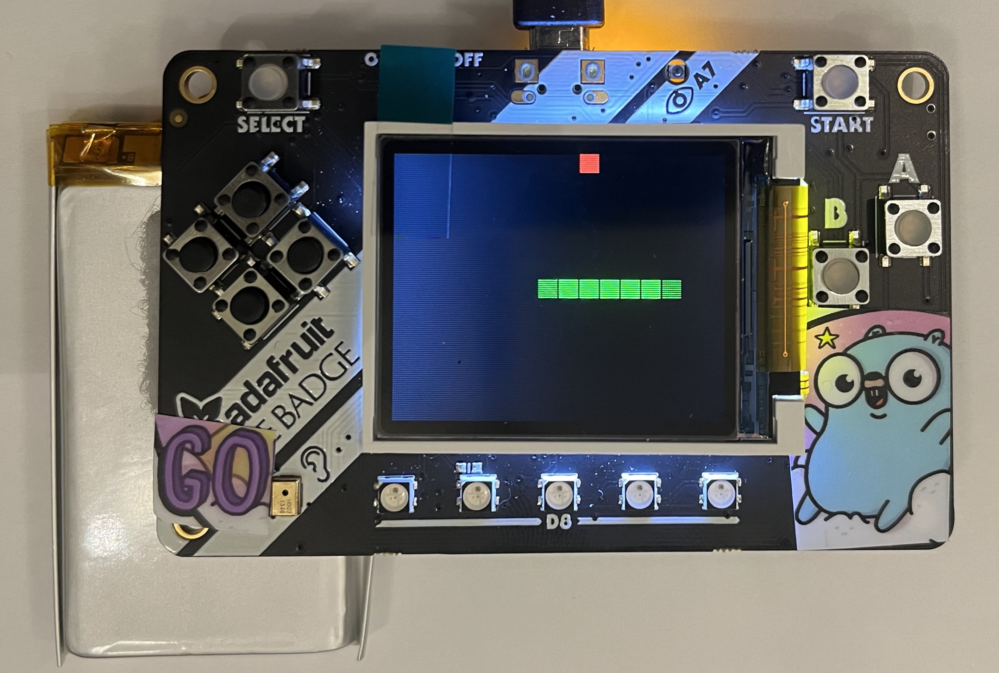
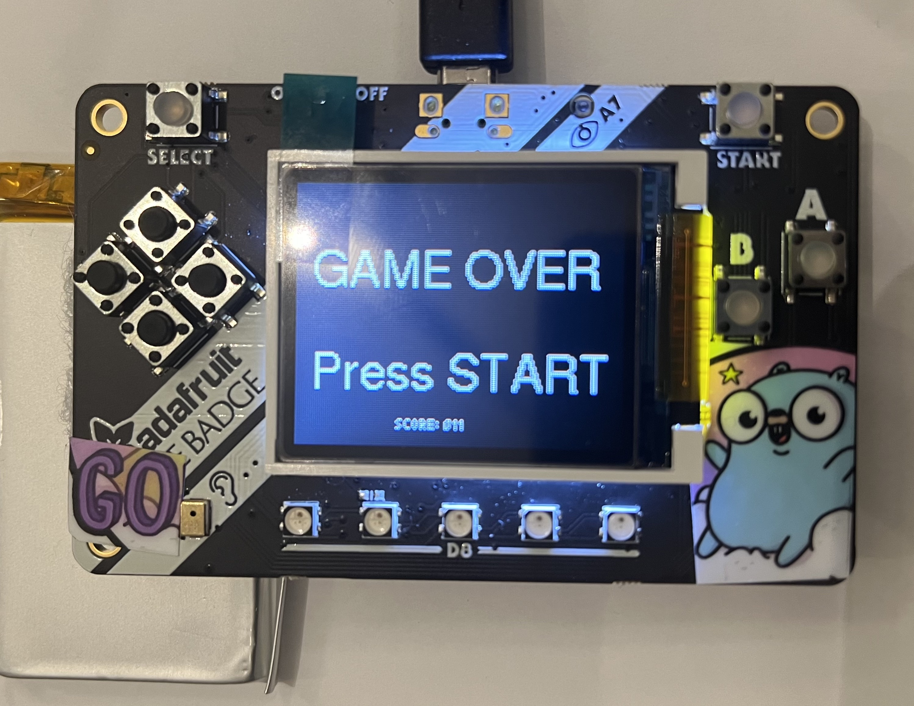

# GoBadge Snake Tutorial

In this tutorial we're going to build a _snake-like_ game from scratch.

## What you need

    - GoBadge aka Adafruit PyBadge
    - Personal computer with Go 1.18/1.19 and TinyGo installed, and a serial port.
    - Have complete the GoBdge tutorial

## Installation

### Go

If somehow you have not installed Go on your computer already, you can download it here:

https://go.dev/dl/

Now you are ready to install TinyGo.

### TinyGo

Follow the instructions here for your operating system:

https://tinygo.org/getting-started/

## Connecting the GoBadge to your computer


Plug the GoBadge into your computer using a USB cable. There may be one provided in your starter kit.

## Running the code

The TinyGo programs will run directly on the GoBadge's microcontoller. The procedure is basically:

- Edit your TinyGo program.
- Compile and flash it to your GoBadge.
- The program executes from the GoBadge. You can disconnect the GoBadge from your computer and plug it into a battery if you wish, the program executes directly on the microcontroller.

Let's get started!

## Code

### step0.go - Get a pixel on the screen

This step is to get familiar with the display and the drawing functions.


```
tinygo flash -target pybadge ./step0/main.go
```

Once the PyBadge is flashed correctly, a green pixel will appear on the middle of the screen. Feel free to change the values of `display.SetPixel` (towards the bottom of the ./step0/main.go file) and see where the pixel appears!



### step1.go - A pixel, but bigger!

Run the code.

```
tinygo flash -target pybadge ./step1/main.go
```



Instead of a pixel, we are drawing a 10x10 green rectangle.

### step2.go - I like to move it, move it

Run the code.

```
tinygo flash -target pybadge ./step2/main.go
```

We listen to the input buttons and move our rectangle across the display.


### step3.go - Run, snake, run

Run the code.

```
tinygo flash -target pybadge ./step3/main.go
```

Have you noticed the snake at the previous step was kind of slow? That was because display.FillScreen draws the whole display and is a slow process, we could improve the speed if only re-draw the pixels that has 
changed. 


### step4.go - Welcome to the grid

Run the code.

```
tinygo flash -target pybadge ./step4/main.go
```

In the previous step, the 10x10 _snake_ was moving by 1 pixel each time, we need to divide our display (160x128) in a 10x10 grid so the snake will move a whole block each time.


### step5.go - Long snake is long

Run the code.

```
tinygo flash -target pybadge ./step5/main.go
```

Our little snake grew from 1 block to 3 block length.



### step6.go - Time to grow up

Feed our snake some red apples so it can grow

```
tinygo flash -target pybadge ./step6/main.go
```



The display will show some blue circles. When a button is pressed a ring will be shown around its corresponding circle.

### step7.go - Score & game mechanics

Run the code.

```
tinygo flash -target pybadge ./step7/main.go
```


Add game mechanics such as collision (game over) and score.



### step8.go - Get wild!

There's no step 8, it's time to get creative and modify the game as you wish, try adding sounds or different colors
